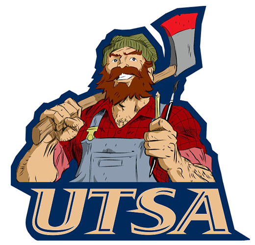
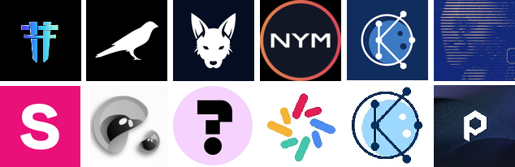
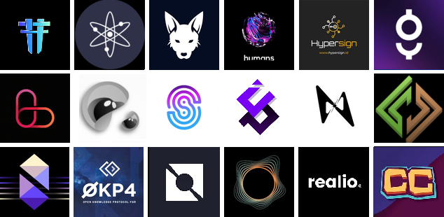

# 𝐥𝐞𝐬𝐧𝐢𝐤 | 𝐔𝐓𝐒𝐀

<figure><figcaption></figcaption></figure>

**lesnik | UTSA** - trustworthy and high performance validator

In addition to protecting the networks in the mainnet through validation, we run IBC, provide RPC, API, Statesync, Addrbook, Explorer, write manuals, maintain high uptime and help the community

Our supported relayers - [https://relayers.smartstake.io/relayer/A0B5FF00B5460153](https://relayers.smartstake.io/relayer/A0B5FF00B5460153)&#x20;

**lesnik | UTSA** validator is ready for long-term cooperation and offers!

***

### Mainnets 

<figure><figcaption></figcaption></figure>

<mark style="color:orange;">**POLKADOT**</mark>

* **Polkadot** - 15wnPRex2QwgWNCMRVSqgqp2syDn8Gf6LPGGabRhA8zoohpt
* **Kusama** - D5khA3qGvd8SDXepSrCGmYRWbNUzdJpjEyg6m1mFT7VtHpw
* **Joystream** - j4W8paZENRiG1i6JVULH5Gz65USGGLhWKEaPBHjHhqDmcmNr9

> You can delegate your GOV voting rights to our validators. Read more about GOV delegation [here](https://support.polkadot.network/support/solutions/articles/65000184123-polkadot-opengov-how-to-delegate-your-voting-power)
>
> 👨‍⚖️ Delegate the right to vote in GOV (not to be confused with coin stake) to the UTSA validator instead of you:
>
> **Polkadot** 👉 [https://delegation.polkadot.network/#/15wnPRex2QwgWNCMRVSqgqp2syDn8Gf6LPGGabRhA8zoohpt](https://delegation.polkadot.network/#/15wnPRex2QwgWNCMRVSqgqp2syDn8Gf6LPGGabRhA8zoohpt)
>
> **Kusama** 👉 [https://delegation.polkadot.network/?network=kusama\&rpc=wss://kusama-rpc.polkadot.io#/D5khA3qGvd8SDXepSrCGmYRWbNUzdJpjEyg6m1mFT7VtHpw](https://delegation.polkadot.network/?network=kusama\&rpc=wss://kusama-rpc.polkadot.io#/D5khA3qGvd8SDXepSrCGmYRWbNUzdJpjEyg6m1mFT7VtHpw)

<mark style="color:orange;">**COSMOS**</mark>

* [Aura (Genesis validator)](https://exp.utsa.tech/aura/staking/auravaloper1vy9qvad4rpczx6r5rwlqvn43l4mkl283m8gk4p)
* Celestia&#x20;
* [Dymension (Genesis validator)](https://exp.utsa.tech/dymension/staking/dymvaloper1taava3hdv33ps7es7yvwjx7x08lzz3s2mqfp6v)
* [Dora](https://exp.utsa.tech/dora/staking/doravaloper12yk434ut3un4wx0rult2aww89rsrel8nhmp387)
* [Nois (Genesis validator)](https://exp.utsa.tech/nois/staking/noisvaloper10hmy2yhwhqqe8p7ax0hrdt4uxkumlhcf7tkkk2)
* [Nibiru (Genesis validator)](https://exp.utsa.tech/nibiru/staking/nibivaloper1he44du3wsg3qgysyj0wlclq20apj880k72m8ks)
* [Realio (Genesis validator)](https://explorer.stavr.tech/realio-mainnet/staking/realiovaloper1pgpx7sqfh5tnuktlhjj39u4hc85wc6jelk9t74)
* [Teritori (Genesis validator)](https://exp.utsa.tech/teritori/staking/torivaloper1kunzrdg6u8gql4faj33lstghhqdtp59e0xgggy)
* [Gitopia (Genesis validator)](https://explorer.stavr.tech/gitopia-m/staking/gitopiavaloper1ae4aurwv0jeccztqgr0s2znyrqlm4jj8hxv908)
* [HAQQ](https://ping.pub/haqq/staking/haqqvaloper1ld747ks23dqheenk3pjth57claqqpfnxax6cea)
* [Uptick](https://exp.utsa.tech/uptick/staking/uptickvaloper1wfaarzcy2rpxr9564tlsyktcf9c75gf0zc57p2)
* [KYVE](https://explorer.kyve.network/kyve/staking/kyvevaloper1gwrhgrlpzkpcx06fkwhd6swuy688xjca38xmsw)
* [Jackal](https://explorer.nodestake.top/jackal/staking/jklvaloper1ejrn54x9wpxarmp7ux2a7mtgt4f8vp5xum9q4p)
* [Qiucksilver](https://explorer.stavr.tech/quicksilver-mainnet/staking/quickvaloper1sztng2ln0wq7thqqyrjd02tc4hh6yu36m4l67x)
* [L1](https://exp.utsa.tech/genesis/staking/genesisvaloper1afvvw56w2uq64qmsurawkxdhu9r98e5ue2kthq)
* [Lava](https://exp.utsa.tech/lava/staking/lava@valoper1rnm6qh4yvgl26etln8dv4gelkcfs3lt64tp7zl)
* [Provenance](https://www.mintscan.io/provenance/validators/pbvaloper19r822ud3e6j7vv4llk569fxlt3778kw7ynlmve)

### Active testnets 

<figure><figcaption></figcaption></figure>

* Airchains
* Arkeo
* [Aura](https://gitopia.com/gitopia14t5474u9ffxmecdhdrk836q5qpd923ppjvmkpq/lesnik_utsa/tree/master/README.md)
* Celestia
* CrossFi
* [CrowdControl](https://explorer.stavr.tech/cardchain/staking/ccvaloper1ryn4vth06ltxp4j97r2r5ym3pwyyx0k24ggdhv)
* Entrypoint
* Galactica
* [Hyper](https://explorer.stavr.tech/hypersign/staking/hidvaloper1vy7j9kwge6gl3kl2445ysgdy2m9eg29e36cv79)
* [Nois](https://explorer.stavr.tech/nois/staking/noisvaloper1zkezs74uqn97u54ncdky2slv8n79zq598z5e9j)
* Story
* Warden
* Zenrock

### Different experience 

* **Minima** - admin [TG](https://t.me/minima_ru) and [Discord](https://discord.gg/Wj9zF49G46)
* **Moonbeam** - [sr. ambassador](https://discord.gg/tfauFdfhdZ)
* **Bounty Manager** - [cryptotalk](https://cryptotalk.org/profile/10901-lesnik_utsa/)
* **Crowd Control** - Russian community manager [Discord](https://discord.gg/VFCTcUnSdW)
* **Haqq** - tech support

**Links:**

* **Explorer** - [https://exp.utsa.tech](https://exp.utsa.tech)
* **Blog** - https://teletype.in/@lesnik13utsa
* **Discord** - lesnik\_utsa#4480
* **Telegram** - @lesnik13utsa
* **Twitter** - @lesnik13utsa
* **Github** - [https://github.com/lesnikutsa](https://github.com/lesnikutsa)
