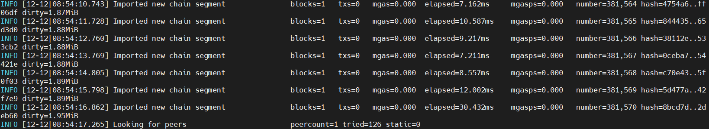

# 💻 Installation

## Server preparation

```shell
apt update && apt upgrade -y
```

```shell
apt install curl iptables build-essential git wget jq make gcc nano tmux htop nvme-cli pkg-config libssl-dev libleveldb-dev tar clang bsdmainutils ncdu unzip chrony libleveldb-dev liblz4-tool -y
```

#### Install GO

```shell
ver="1.21.3" && \
wget "https://golang.org/dl/go$ver.linux-amd64.tar.gz" && \
sudo rm -rf /usr/local/go && \
sudo tar -C /usr/local -xzf "go$ver.linux-amd64.tar.gz" && \
rm "go$ver.linux-amd64.tar.gz" && \
echo "export PATH=$PATH:/usr/local/go/bin:$HOME/go/bin" >> $HOME/.bash_profile && \
source $HOME/.bash_profile && \
go version
```


⚠️ Important: that your ACN ports are open (currently port 20203). This can be changed after launch by [updating your enodes](https://docs.autonity.org/validators/migrate-vali/#migrating-validator-node-to-a-new-ipport-address). If the port is not open, your validator will be considered offline and will be jailed.


**Install ethkey, which we will need later to extract the private key**

```bash
git clone https://github.com/autonity/autonity.git autonity1
cd autonity1
make all
mv build/bin/ethkey /usr/local/bin

ethkey --version
#ethkey version 1.0.2-alpha-8be1825c-20241209
```


Important: If you have problems installing aut or other binaries, add the following variables and do a make clean before reinstalling

```bash
export CGO_CFLAGS="-O -D__BLST_PORTABLE__" 
export CGO_CFLAGS_ALLOW="-O -D__BLST_PORTABLE__"
make clean
```



## Node installation

#### Install Autonity Utility (aut)

<pre class="language-shell"><code class="lang-shell"><strong># for ubuntu 20.04
</strong>cd
apt install python3-pip &#x26;&#x26; \
apt install python3.8-venv &#x26;&#x26; \
pip install pipx

# for ubuntu 22.04
cd
apt install python3-pip &#x26;&#x26; \
apt install python3.10-venv &#x26;&#x26; \
pip install pipx

# for new installation
pipx install autonity-cli
mv /root/.local/bin/aut /usr/local/bin/aut

aut --version
#aut, version 1.0.0

# for update
pipx upgrade autonity-cli
</code></pre>


**Create an `.autrc` file, thanks to which the aut utility will search for a specific configuration**

```bash
tee <<EOF >/dev/null $HOME/.autrc
[aut]
rpc_endpoint= ws://127.0.0.1:8546
EOF
```


#### **Installing Autonity node**

```shell
cd
git clone https://github.com/autonity/autonity && cd autonity
git checkout tags/v1.1.1 -b v1.1.1
make autonity

mv $HOME/autonity/build/bin/autonity /usr/local/bin/
autonity version
#Version: 1.1.1
```

**Create a directory autonity-chaindata to store autonity working data and create the keys we need**


We need to create nodekey, tresure.key and oracle.key

**nodekey** is the main node key from which the validator address and enode are generated

**tresure.key** will be our treasury. With this key we will make a delegation to the validator and we will receive rewards to this key

**oracle.key** will be used as a cryptographic identifier of the Oracle server and will be used to sign price report transactions sent to the Oracle Contract on-chain

Transaction costs for sending price report data on the network are reimbursed, but you must first top up the oracle.key account to prevent an insufficient gas error on the first transaction.

!!!Be sure to top up the Oracle wallet after starting the node!!!


```shell
cd
mkdir -p $HOME/autonity-chaindata/autonity
# generate nodekey
autonity genAutonityKeys $HOME/autonity-chaindata/autonity/nodekey --writeaddress

mkdir -p $HOME/.autonity/keystore
# generate oracle.key
aut account new -k $HOME/.autonity/keystore/oracle.key

# generate tresure.key
aut account new -k $HOME/.autonity/keystore/tresure.key
```


Important: Be sure to make backup copies of your keys. Also remember the passphrase you used when creating it! If you do not remember the password, you will not be able to decrypt this private key file and you may lose all funds associated with this account!!!


**Now we add our tresure key to .autrc**

```bash
nano $HOME/.autrc

# the line is added
keyfile=/root/.autonity/keystore/tresure.key
```

**Create a service file**

```shell
tee <<EOF >/dev/null /etc/systemd/system/autonity.service
[Unit]
Description=autonity node
After=network.target

[Service]
User=$USER
Type=simple
ExecStart=$(which autonity) --datadir $HOME/autonity-chaindata --syncmode full --bakerloo --http --http.addr 0.0.0.0 --http.api aut,eth,net,txpool,web3,admin --http.vhosts \*  --ws     --ws.addr 127.0.0.1 --ws.api aut,eth,net,txpool,web3,admin --autonitykeys $HOME/autonity-chaindata/autonity/nodekey --nat extip:$(curl 2ip.ru)
Restart=on-failure
LimitNOFILE=65535

[Install]
WantedBy=multi-user.target
EOF
```

```shell
systemctl daemon-reload
systemctl enable autonity
systemctl restart autonity && journalctl -u autonity -f -o cat
```

<figure><figcaption></figcaption></figure>


